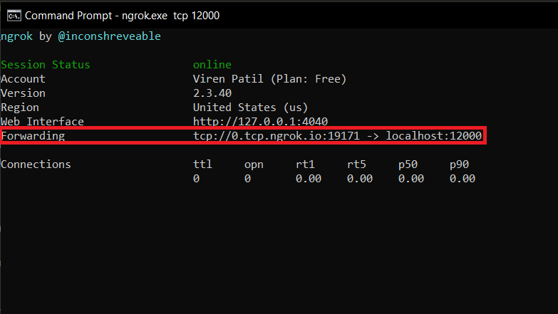

# TCP Chatroom

A decent looking UI generated on top of a TCP Client-Server Chatroom. Developed initially as a part of coursework in college, enhanced as a result of tedious and problematic usage of the chatroom on terminal. 

## Getting Started

Clone/Download the project from the repository. Navigate to the folder containing *client_gui.py* and *server_gui.py* files. Open two terminal windows in the same path. Make sure you run the commands in the order shown below.

Terminal Window 1:
```
python server_gui.py <port-number>
```
Terminal Window 2:
```
python client_gui.py <port-number>
```

Make sure that the port numbers used in both the above commands are same. A different port number won't allow the client to get connected to the server. The port number should be entered without the angular brackets.

For example:

Terminal Window 1:
```
python server_gui.py 12000
```
Terminal Window 2:
```
python client_gui.py 12000
```

Make sure you choose a port number that is free (i.e. not listening) on your system. Use *netstat* command to know which ports are open and can be used.

If you followed all steps properly you should be able to see the chat window as shown at the end of this README.

### Prerequisites

* Python 3.8 or above
* Tkinter v8.6
* **socket** library and **_thread** library (most likely already installed on your system, both Linux and Windows)


### Installing

Steps to install Python 3.8 can be found at [python.org](https://www.python.org/)

Tkinter comes along with Python 3.8 installation.

To check if python has installed properly follow this:
```
python --version
```

To check the version of Tkinter follow:

Open terminal and open python interpreter. Execute the following.
```
import tkinter
tkinter.TkVersion
```

## Making sure everything is running properly

After you started the server and also ran the client to connect to it, make sure to check the terminal on which server is running. It should show no errors and should show some printed statements telling about the number of people in the chatroom. 


If you can see that you are all set, Cheers! 


## Deployment

You might be wondering what is the use if I am the only one able to enter the chatroom (since the server is running on localhost). Don't worry I have a solution for that.

* You can deploy the server on a public IP (which is what I would recommend as it is safer than the alternative I'll be listing next)

* Alternatively you can use [ngrok](https://ngrok.com) to do port forwarding.
Create and account and login. Download ngrok. Follow the steps 1 and 2 displayed on the dashboard.


### Port forwarding using ngrok

Navigate to the installed folder and make sure it has the executable file ngrok in it.

On powershell run:
```
./ngrok tcp 12000
```
On command prompt run:
```
ngrok.exe tcp 12000
```
The port number to be used above should be the one on which you will be running the server on your localhost.
You should see the following after executing the above command:



Observe the highlighted line. It says the access to **tcp://0.tcp.ngrok.io:19171** will be forwarded to **localhost:12000**

This basically means that when client will try to access **tcp://0.tcp.ngrok.io:19171** it will be forwarded to you system's **localhost:12000**

Open a terminal and run:
```
ping 0.tcp.ngrok.io
```
**Note the IP that is shown on the screen after running this command.**

Note that I haven't used the *tcp://* part of the domain name and neither the *:19171* while doin ping

### Edit the client code

Open the file client_gui.py and edit the line:
```
server_host='127.0.0.1'
```
and change it to
```
server_host='<IP which you noted down above>'
```
Type the IP in quotes without the angular brackets.

### Running the server

```
python server_gui.py 12000
```

Make sure to keep the port number same as the one you had used while running *ngrok* command [previously](#port-forwarding-using-ngrok).

### Running the client

```
python client_gui.py 19171
```
**Notice the port number that I have used.** Yes you read it right. It will **not be** 12000, instead it will be the port number on which **ngrok is listening which is 19171** as it is evident from the image [above](#port-forwarding-using-ngrok).

If you did everything alright then the application should run just fine.

For trying out at your own end, open 2 different client connections, i.e. run:
```
python client_gui.py 12000
```
two times on different terminals and enter with different names to be able to experience chat between 2 people.

The application supports upto 10-15 client connections at a time. Not been tested for more than 20 connections.

To chat with your friends, you run the server and do the port forwarding using ngrok and give the [edited](#edit-the-client-code) *client_gui.py* file to your friends and make them run it in their systems as explained in [Running the client](#running-the-client)

## Built With

* Python

## Editor used for development

* VSCode

## Acknowledgments

* Icons made by **Vectors Market** from [www.flaticon.com](www.flaticon.com)

## Snapshots of the application in use

Enter your name that will be displayed to others in the chatroom


Server terminal which shows who entered and who left the chat.


Further pictures show the different features in the chat like being able to use some emojis and also able to view all the participants present in the chat.


